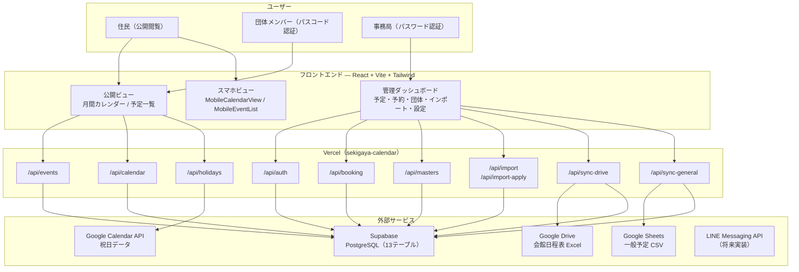
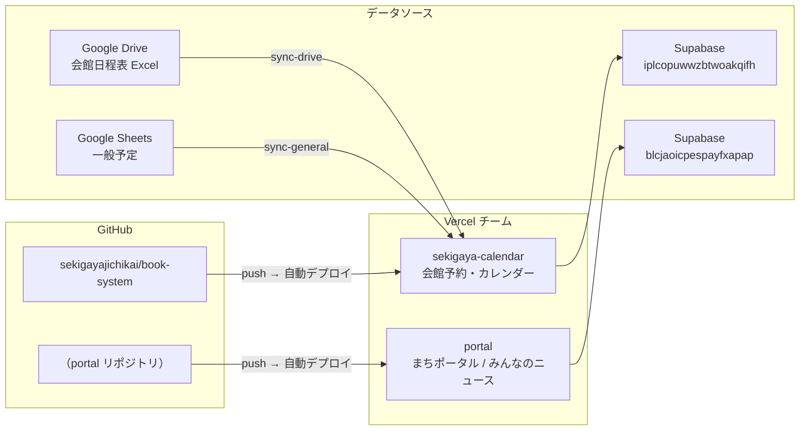

# 関ヶ谷自治会 会館予約システム — dbdiagram.io 用 DSL

## 1. システム構成図（dbdiagram.io では描けないので Mermaid で）



---

## 2. プロジェクト関係図（Mermaid）



---

## 3. DB テーブル関係図（dbdiagram.io DBML）

```dbml
// ========== マスタテーブル ==========

Table booking_rooms {
  id uuid [pk]
  name text [unique, not null, note: '会議室 / 和室（畳側）/ 和室（椅子側）/ 図書室']
  short_name text [not null]
  capacity integer
  description text
  sort_order integer
  created_at timestamptz
}

Table booking_time_slots {
  id uuid [pk]
  slot_key text [unique, not null, note: '午前 / 午後 / 夜間']
  label text [not null]
  start_time time [not null]
  end_time time [not null]
  sort_order integer
  created_at timestamptz
}

Table booking_equipment {
  id uuid [pk]
  name text [not null]
  price integer
  sort_order integer
  created_at timestamptz
}

Table booking_usage_categories {
  id uuid [pk]
  name text [not null]
  tier text [not null, note: '1〜5']
  price_type text [not null]
  price_large integer
  price_small integer
  sort_order integer
  created_at timestamptz
}

Table booking_org_groups {
  id uuid [pk]
  name text [unique, not null, note: '自治会 / 委員会 / 一般 / その他']
  default_tier text
  sort_order integer
  created_at timestamptz
}

Table event_locations {
  id uuid [pk]
  name text [unique, not null]
  sort_order integer
  created_at timestamptz
}

Table app_settings {
  key text [pk]
  value text [not null]
  updated_at timestamptz
}

// ========== 団体 ==========

Table booking_organizations {
  id uuid [pk]
  name text [not null]
  category text [not null, note: '利用区分 1〜5']
  group_name text [note: 'booking_org_groups.name']
  passcode text
  contact_email text
  registration_no text
  furigana text
  representative text
  rep_last_name text
  rep_first_name text
  rep_last_name_kana text
  rep_first_name_kana text
  han_ko text
  phone text
  activity_description text
  has_monthly_fee boolean
  registration_date date
  default_equipment text
  presets text
  keywords text
  is_active boolean
  notes text
  created_at timestamptz
  updated_at timestamptz
}

// ========== カレンダーイベント ==========

Table calendar_events {
  id uuid [pk]
  date date [not null]
  title text [not null]
  display_title text
  location text
  start_time time
  end_time time
  memo text
  is_announcement boolean
  announcement_text text
  is_closure boolean
  event_type text [not null, default: 'general', note: 'general / facility / closure']
  visibility text [not null, default: 'public', note: 'public / internal']
  org_id uuid [ref: > booking_organizations.id]
  org_name text
  description text
  is_major boolean
  created_at timestamptz
  updated_at timestamptz
}

// ========== 予約 ==========

Table bookings {
  id uuid [pk]
  date date [not null]
  slot text [not null, note: '午前 / 午後 / 夜間']
  room text [not null, note: '会議室 / 和室 etc.']
  title text [not null]
  org_id uuid [ref: > booking_organizations.id]
  event_id uuid [ref: > calendar_events.id]
  status text [default: 'CONFIRMED', note: 'CONFIRMED / PENDING / CANCELLED / REJECTED']
  category text
  equipment text
  price integer
  memo text
  created_by text
  approved_by text
  approved_at timestamptz
  reject_reason text
  created_at timestamptz
  updated_at timestamptz

  indexes {
    (date, slot, room) [unique, note: 'WHERE status IN (CONFIRMED, PENDING)']
  }
}

// ========== インポート ==========

Table import_batches {
  id uuid [pk]
  source_file text [not null, default: '会館日程表（新）.xlsx']
  source_hash text
  source_updated_at date
  target_year integer [not null]
  target_month integer [not null]
  status text [not null, default: 'pending', note: 'pending / reviewing / applied']
  total_rows integer
  stats jsonb
  applied_at timestamptz
  created_at timestamptz
}

Table import_rows {
  id uuid [pk]
  batch_id uuid [not null, ref: > import_batches.id]
  date date [not null]
  slot text [not null]
  room text [not null]
  title text [not null]
  org_guess text
  org_id uuid [ref: > booking_organizations.id]
  diff_type text [not null, default: 'add', note: 'add / update / delete / skip']
  existing_booking_id uuid
  existing_title text
  review_status text [not null, default: 'pending']
  review_note text
  created_at timestamptz
}

// ========== バナー ==========

Table calendar_banners {
  id uuid [pk]
  title text [not null]
  description text
  event_date date [not null]
  event_time text
  event_location text
  display_start date [not null]
  display_end date [not null]
  style text [default: 'green']
  image_url text
  sort_order integer
  created_at timestamptz
}
```
